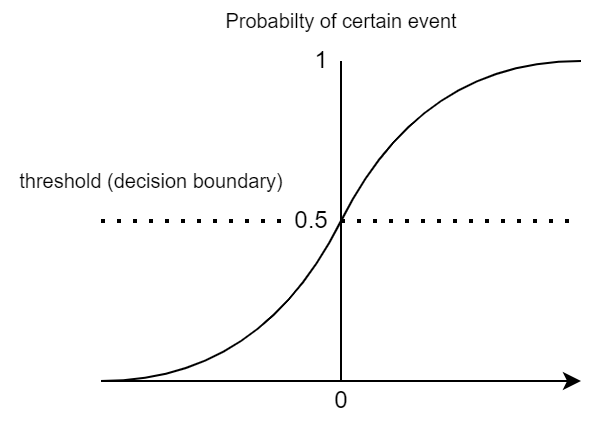

## Logistic Regression

- produce a logistic curve, which is limited to values between 0 and 1
- threshold(decision boundary) set to determine the output class
- adjustment of the threshold to shifting the focus onto certain class
- optimal value for the threshold based on ROC curve

---
| One vs All | One vs One |
| -- | -- |
|separate each classes into a single regression models of the selected class and ‘other’ classes | separate each classes into a combination of the selected class and 1 of the ‘other’ classes|
